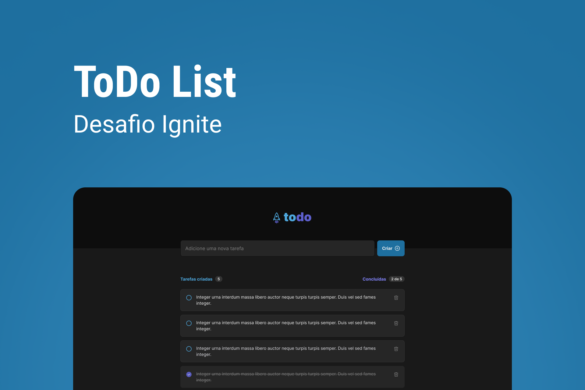

# ToDo List - Desafio 01 Ignite

# Sobre o desafio

Nesse desafio, vai ser desenvolvido uma aplicação de controle de tarefas no estilo **to-do list**, que contém as seguintes funcionalidades:

- Adicionar uma nova tarefa
- Marcar e desmarcar uma tarefa como concluída
- Remover uma tarefa da listagem
- Mostrar o progresso de conclusão das tarefas

Apesar de serem poucas funcionalidades, foi relembado alguns conceitos como:

- Estados
- Imutabilidade do estado
- Listas e chaves no ReactJS
- Propriedades
- Componentização

# Layout da aplicação

Foi fornecido pela equipe Rocketseat via figma.