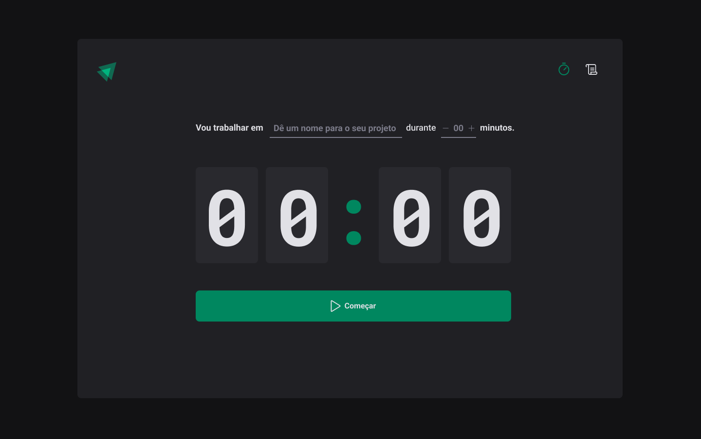
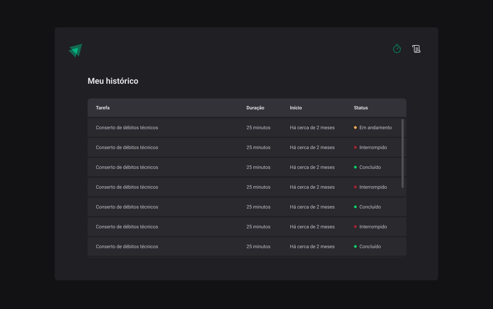

# Timer - Aula 02 Ignite

    
    

# Sobre a aula - Criando SPAs com ReactJS

Nesse módulo foi construído uma aplicação completa com roteamento e diversos conceitos do ecossistema React como ContextAPI, useReducer, immer e validação de formulário com zod.

Funcionalidades aprendidas:

- Estados
- ContextAPI
- LocalStorage
- Imutabilidade do estado
- Listas e chaves no ReactJS
- Propriedades
- Componentização

# Layout da aplicação

Fornecido pela equipe Rocketseat via figma.