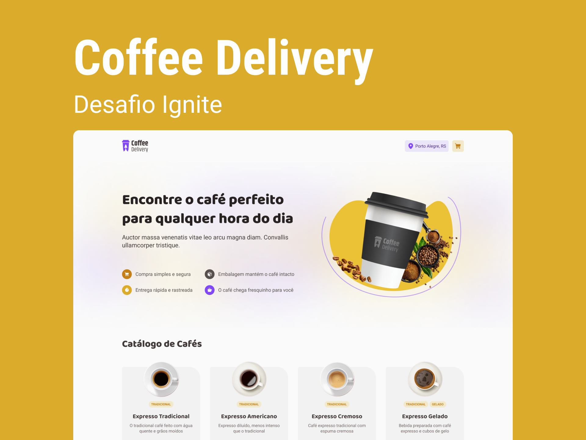

# [Em desenvolvimento] Coffee Delivery - Desafio 02 Ignite

# Sobre o desafio

Nesse desafio, ai ser desenvolvido uma aplicação para gerenciar um **carrinho de compras de uma cafeteria fictícia**, que contém as seguintes funcionalidades:

- Listagem de produtos (cafés) disponíveis para compra
- Adicionar uma quantidade específicas de itens no carrinho
- Aumentar ou remover a quantidade de itens no carrinho
- Formulário para o usuário preencher o seu endereço
- Exibir o total de itens no carrinho no Header
- Exibir o valor total da soma de itens no carrinho multiplicados pelo valor

Apesar de serem poucas funcionalidades, você vai precisar relembrar conceitos como:

- Estados
- ContextAPI
- LocalStorage
- Imutabilidade do estado
- Listas e chaves no ReactJS
- Propriedades
- Componentização

# Layout da aplicação

Para essa aplicação nós fornecemos um layout para que você possa seguir e implementar todas as funcionalidades desenhadas no figma.