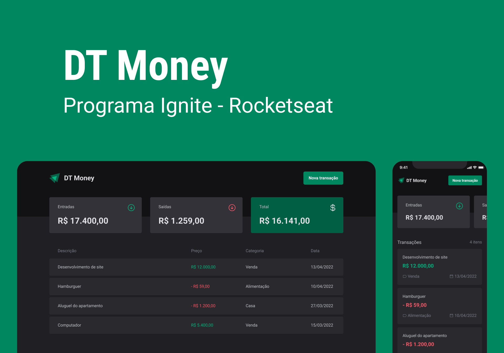

# [Em desenvolvimento] Aula 03 - DT Money

# Sobre a aula - Consumo de API e performance no ReactJS

Nesse módulo construiremos uma aplicação front-end web completa, conectando a uma API e veremos como performar aplicações com o React entendendo como funcionam os algoritmos internos da biblioteca e todo fluxo de renderização de componentes.

Revisão de conhecimentos:

- Estados
- ContextAPI
- Imutabilidade do estado

Funcionalidades aprendidas:

- Consumo de API Rest com [json-server](https://github.com/typicode/json-server)

# Layout da aplicação

Fornecido pela equipe Rocketseat via figma.

---

Made with 🧡 by <a href="https://www.linkedin.com/in/jaquelinepeixer/" target="_blank">Jaqueline Peixer</a>
