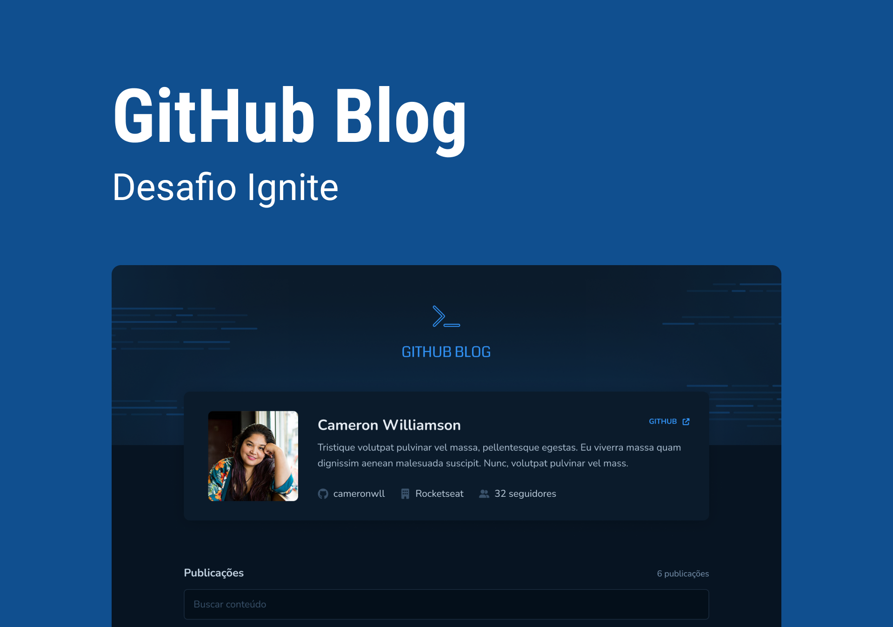

# [Em desenvolvimento] Github Blog - Desafio 02 Ignite

# Sobre o desafio

Nesse desafio, foi desenvolvido uma aplicação que utilizará da API do GitHub para buscar issues de um repositório, dados do perfil e exibi-las como um blog.

- Listagem do perfil com imagem, número de seguidores, nome e outras informações disponíveis pela API do GitHub.
- Listar e filtrar todas as issues do repositório com um pequeno resumo do conteúdo.
- Criar uma página para exibir um post (issue) completo.

Apesar de serem poucas funcionalidades, foi utilizados os seguintes conceitos:

- Fetch / Axios
- Roteamento e React Router DOM
- Formulários

# Layout da aplicação

Para essa aplicação foi fornecido pela Rocketseat o layout para implementação de todas as funcionalidades via Figma.

---

Made with 🧡 by <a href="https://www.linkedin.com/in/jaquelinepeixer/" target="_blank">Jaqueline Peixer</a>
