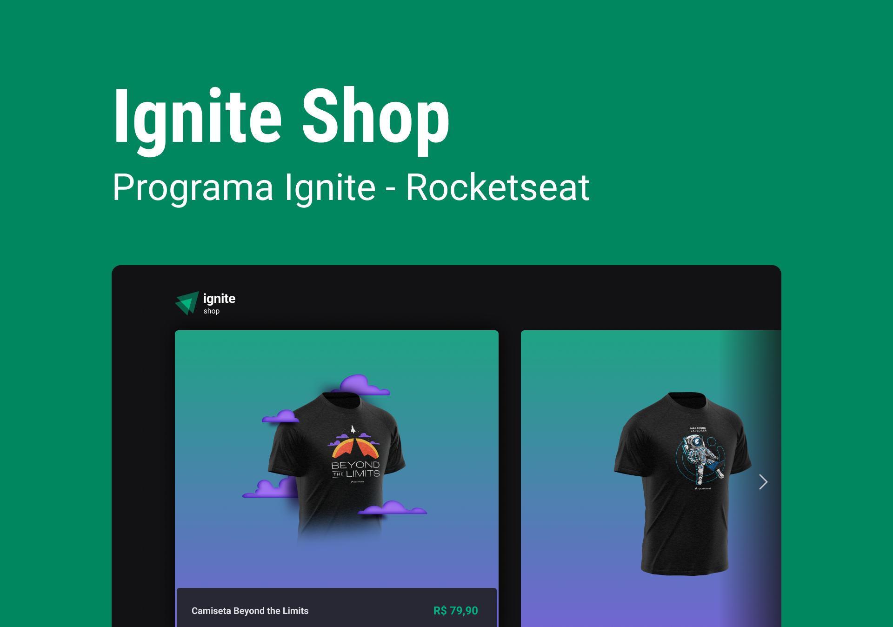

# [Em desenvolvimento] Aula 03 - Ignite Shop

# Sobre a aula - Fundamentos do Next.js

Nesse módulo criaremos um projeto completo com o framework Next.js. Vamos utilizar StitchesJS, passando por conceitos de SPA, server-side rendering (SSR) e static-site generation (SSG).

# Layout da aplicação

Fornecido pela equipe Rocketseat via figma.

---

Made with 🧡 by <a href="https://www.linkedin.com/in/jaquelinepeixer/" target="_blank">Jaqueline Peixer</a>